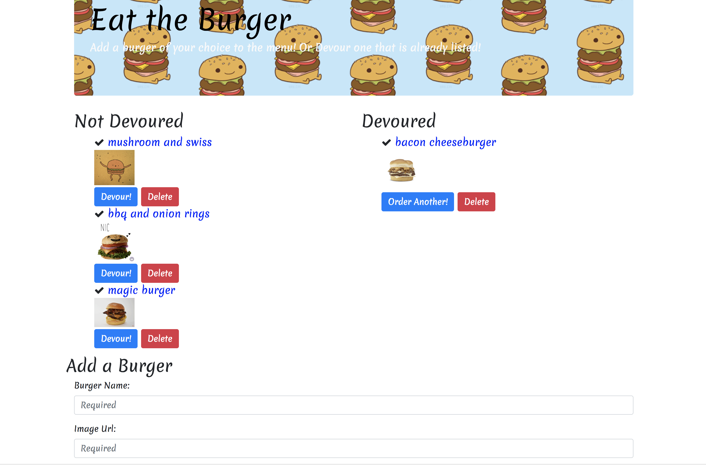

# burgers order app
- Node Express server with sql database connexion using H   andlebars and Sequelize

## how to run the project

- npm i
- npm i (all dependencies in package.json)
- connect to your local sql data base (localhost, user: root, password "" for mac "root" for other)
- run the queries in the "schema.sql" and "seeds.sql"
- node server.js
- go to localhost:8080

## Enjoy
